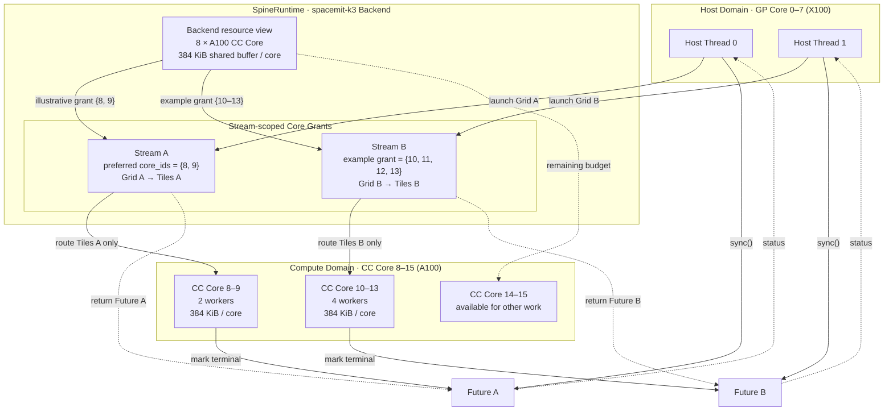
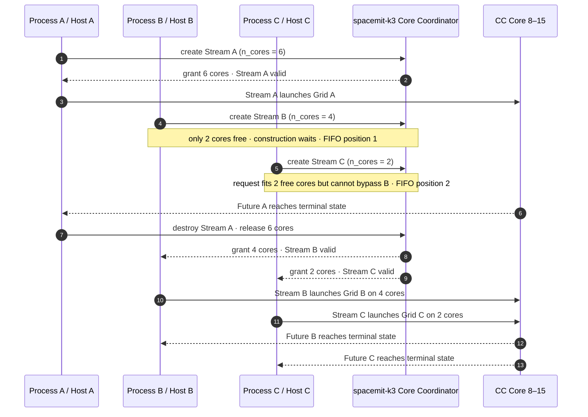

# SpineRuntime

English | [简体中文](README_ZH.md)

**SpacemiT RISC-V AI Many-Core Execution Runtime**

SpineRuntime (library name: `spert`) targets SpacemiT RISC-V SoCs and coordinates parallel tasks between general-purpose host cores and AI compute cores. The SDK is distributed as the prebuilt `libspert` shared library, public C++ headers, and a compiler-integration ABI. Applications describe only the compute grid and tile kernel; the runtime handles Backend selection, compute-core resource allocation, task scheduling, synchronization, and resource reclamation.

## Introduction

SpineRuntime provides a Tile-SPMD (Single Program, Multiple Data) programming model: each `launch` instantiates the same kernel as a set of tiles, with every tile processing one coordinate in the grid. Applications do not need to manage AI compute-core threads directly. The same scheduling code runs across different SpacemiT platforms and generic/qemu environments through a unified interface.

Key features include:

- **Modern C++17 API**: Uses strongly typed parameters, RAII handles, and `enum class Status`, eliminating the need to manually wrap `void*` arguments.
- **1D/2D/3D Tile-SPMD**: Describes the parallel space with `Grid` and queries tile coordinates and grid dimensions through `Context`.
- **Stream-level multicore execution**: Each `Stream` owns a set of compute-core resources granted by the Backend. Tiles submitted to that Stream run only within the corresponding resource set.
- **Asynchronous tasks and combined waits**: `launch` returns a `Future`, supporting waits for a single task, timed waits, and combined waits for multiple tasks.
- **In-tile cooperation**: Provides whole-grid synchronization, Barriers, Events, child-task `spawn/join`, and cooperative `yield`.
- **Per-core shared buffers**: A kernel can access the current compute core's shared scratchpad or allocate and release tile-private slices on demand.
- **Multiple coexisting Backends**: Supports automatic selection of the default Backend and access to independent `BackendHandle` instances by name.
- **Stable integration boundary**: Template arguments are wrapped into types on the application side, while the prebuilt runtime receives tasks through non-template interfaces. Binary compatibility is bounded by matching SDK headers and the `libspert` SONAME major version.

The overall usage relationship is as follows:

```text
Host application / compiler-generated code
           │
           ├── C++ API: spert.hpp
           └── Integration ABI: spert_abi.h
                       │
                 BackendHandle
                       │
          ┌────────────┴────────────┐
        Stream A                  Stream B
          │                         │
     Grid → Tiles              Grid → Tiles
          │                         │
     Granted CC Cores          Granted CC Cores
```

## Quickstart

The two workflows below use the same standalone demo. Save the following source as `demo.cpp`:

```cpp
#include "spert.hpp"

#include <cstdint>
#include <iostream>
#include <vector>

void fill_squares(spert::Context* ctx, uint32_t* output, uint32_t count) {
    const uint32_t index = ctx->program_id(0);
    if (index < count) {
        output[index] = index * index;
    }
}

int main() {
    constexpr uint32_t kTiles = 8;
    std::vector<uint32_t> output(kTiles, 0);

    spert::Stream stream;
    if (!stream.valid()) {
        std::cerr << "failed to create a SpineRuntime stream\n";
        return 1;
    }

    spert::Future future =
        stream.launch(spert::Grid(kTiles), fill_squares, output.data(), kTiles);
    if (!future.valid()) {
        std::cerr << "failed to launch the grid\n";
        return 2;
    }

    const spert::Status status = future.sync();
    if (status != spert::Status::Ok) {
        std::cerr << "grid failed: " << spert::to_string(status) << '\n';
        return 3;
    }

    for (uint32_t i = 0; i < kTiles; ++i) {
        if (output[i] != i * i) {
            std::cerr << "unexpected result at tile " << i << '\n';
            return 4;
        }
    }

    std::cout << "SpineRuntime quickstart passed on " << stream.core_count()
              << " core(s)\n";
    return 0;
}
```

For the CMake-based workflow, save this file as `CMakeLists.txt` beside `demo.cpp`:

```cmake
cmake_minimum_required(VERSION 3.16)
project(spine_quickstart LANGUAGES CXX)

set(CMAKE_CXX_STANDARD 17)
set(CMAKE_CXX_STANDARD_REQUIRED ON)

find_package(spine-runtime CONFIG REQUIRED)

add_executable(spine_quickstart demo.cpp)
target_link_libraries(spine_quickstart PRIVATE spine-runtime::spert)
```

### Option 1: Cross-compile with a prebuilt SDK

Use this path on a development host that has a RISC-V cross toolchain. Extract the released `spine-runtime.xxx.tar.gz`, point CMake at both the toolchain file and the extracted SDK, and build the demo:

```bash
tar -xf spine-runtime.xxx.tar.gz
export SPINE_RUNTIME_SDK=/absolute/path/to/extracted/spine-runtime

cmake -S . -B build-k3 \
  -DCMAKE_TOOLCHAIN_FILE=/absolute/path/to/riscv64-toolchain.cmake \
  -DCMAKE_PREFIX_PATH="$SPINE_RUNTIME_SDK"
cmake --build build-k3 --parallel
```

The archive name, extraction directory, toolchain file, and sysroot are release- and toolchain-specific; replace the placeholders with paths from your SDK delivery. Before running the executable, K3 must provide an ABI-compatible `libspert`. The following example installs the board package; confirm its `libspert` SONAME and API compatibility against the SDK release notes. If they do not match, deploy `libspert` from the same SDK archive and configure the board's dynamic-library search path instead.

```bash
export K3_HOST=root@k3-board-address
ssh "$K3_HOST" 'apt install -y spacemit-runtime'
scp build-k3/spine_quickstart "$K3_HOST":/tmp/
ssh "$K3_HOST" /tmp/spine_quickstart
```

This cross-compilation outline is intended as an integration template and is not executed as part of this repository's documentation verification.

### Option 2: Build natively on K3

On a K3 board running Bianbu, install SpineRuntime and the native build tools. Run the package command as `root`, or prefix it with `sudo`; refresh the APT package index first if it is stale.

```bash
apt install -y spacemit-runtime g++ pkg-config
g++ -std=c++17 demo.cpp \
  $(pkg-config --cflags --libs spine-runtime) \
  -pthread -o spine_quickstart
./spine_quickstart
```

This workflow was verified on a Bianbu 4.0.2 riscv64 K3 board with `spacemit-runtime 0.6.0+1`. The observed output was:

```text
SpineRuntime quickstart passed on 8 core(s)
```

The reported core count is the number actually granted to the Stream and can vary when other Streams or processes are using K3 compute cores.

## Programming Model

### Core Objects

| Object | Role |
|---|---|
| `BackendHandle` | Identifies a Backend instance that remains valid for the lifetime of the process; copyable and non-owning. |
| `BackendInfo` | Describes a Backend's compute-core count, per-core shared-buffer capacity, vector length, and architecture ID. |
| `Grid` | Describes a 1D, 2D, or 3D tile grid; the product of all valid dimensions is the total tile count. |
| `StreamConfig` | Configures the desired compute-core count or preferred physical core IDs. |
| `Stream` | A move-only RAII execution domain that manages Backend-granted compute-core resources and task lifetimes. |
| `Context` | The execution context passed by the runtime to each tile; valid only during that kernel invocation. |
| `Future` | A shared completion handle for a `launch` or `spawn`. |
| `Barrier` / `Event` | Bound to the Stream that created them and used for cooperative synchronization between tiles. |
| `SharedBufferView` | A non-owning view of the current compute core's shared scratchpad. |

### Tile Kernel

A kernel is a user-defined callable whose first parameter must be `spert::Context*`. Remaining arguments are stored by value by `launch`. Pointers can provide access to shared inputs and outputs, but the caller must ensure that the pointed-to data remains valid until the `Future` completes.

Every tile executes the same kernel and determines its assigned data range through these interfaces:

- `program_id(dim)`: Returns the current tile's coordinate in the specified dimension.
- `grid_dim(dim)`: Returns the grid size in the specified dimension.

### Minimal Example

The following example uses `Grid(2, 4)` to divide vector addition across eight tiles and flattens the two-dimensional tile coordinates into a linear index:

```cpp
#include "spert.hpp"

#include <cstdint>
#include <vector>

void vector_add(spert::Context* ctx,
                const float* a,
                const float* b,
                float* output,
                uint32_t size) {
    const uint32_t grid_x = ctx->grid_dim(0);
    const uint32_t grid_y = ctx->grid_dim(1);
    const uint32_t tile_id = ctx->program_id(1) * grid_x + ctx->program_id(0);
    const uint32_t tiles = grid_x * grid_y;

    for (uint32_t i = tile_id; i < size; i += tiles) {
        output[i] = a[i] + b[i];
    }
}

int main() {
    constexpr uint32_t size = 4096;
    std::vector<float> a(size, 1.0f);
    std::vector<float> b(size, 2.0f);
    std::vector<float> output(size, 0.0f);

    spert::Stream stream;
    if (!stream.valid()) {
        return 1;
    }

    spert::Future future = stream.launch(
        spert::Grid(2, 4), vector_add, a.data(), b.data(), output.data(), size);
    if (!future.valid()) {
        return 2;
    }

    const spert::Status status = future.sync();
    return status == spert::Status::Ok ? 0 : 3;
}
```

### Task Dependencies and Synchronization

`launch` is an asynchronous submission interface. Kernels with read/write dependencies should establish an explicit execution order through `Future::sync()`, `Future::sync_all()`, or in-tile cooperation primitives. Independent tasks can be submitted consecutively and then waited on together.

```cpp
auto f0 = stream.launch(spert::Grid(n), kernel0, args0);
auto f1 = stream.launch(spert::Grid(n), kernel1, args1);

spert::Status status = spert::Future::sync_all({f0, f1});
spert::Status timed = spert::Future::sync_all({f0, f1}, 1000);
```

A timed wait affects only that wait call; it does not cancel tasks that are still running.

## Multicore Scheduling Model

### Streams and Compute-Core Resources

`Stream` is SpineRuntime's unit of multicore execution and resource isolation. When a Stream is created, the runtime requests a set of compute cores from the specified Backend. `n_cores == 0` requests all compute cores that are currently available. An application can also use `StreamConfig::core_ids` to specify preferred physical core IDs. If the exact core set cannot be granted, the runtime falls back to a core-count request.

```cpp
spert::BackendHandle backend = spert::backend("spacemit-k3");
if (!backend.valid()) {
    return 1;
}

spert::StreamConfig config;
config.n_cores = 2;
config.core_ids = {8, 9};

spert::Stream stream(backend, config);
if (!stream.valid()) {
    return 2;
}
```

Each Backend instance maintains independent runtime resources. A process can create multiple Streams, and multiple host threads can concurrently submit tasks to the same Stream. The effective parallelism of different Streams is jointly determined by the compute-core sets granted by the Backend, platform resource availability, and system scheduling policy.

### spacemit-k3 Scheduling Example

The following diagram uses two independent Streams on K3 to illustrate the relationship between Host submission, Backend core grants, tile routing, and Future completion:



The scheduling process shown in the diagram can be understood as follows:

1. Host threads run on K3 GP Cores 0–7 and can submit Grids to Streams separately or concurrently.
2. The `spacemit-k3` Backend exposes eight A100 CC Cores (physical IDs 8–15), each with 384 KiB of shared-buffer capacity.
3. Stream A prefers the core set `{8, 9}`. Both `{8, 9}` and Stream B's `{10, 11, 12, 13}` are example grants when sufficient resources are available. Each Stream's tiles are routed only to its own granted core set.
4. Each CC Core has one resident worker. When a tile waits on a Barrier, Event, Future join, or shared-buffer allocation, it can be cooperatively suspended so that the worker can execute another ready tile.
5. The two `launch` calls return Future A and Future B respectively. After the CC Cores complete the corresponding Grid, they move its Future to a terminal state. The Host can wait for each Future separately or use `Future::sync_all()` to wait for both. Barriers, Events, and in-tile Future joins can be used only within their owning Stream.

The core allocation in the diagram illustrates scheduling relationships only; it is not a fixed partition. Actual grants depend on currently available resources, usage by other Streams or processes, and Backend coordination. Applications should check `Stream::valid()` and obtain the actual core count through `Stream::core_count()`.

#### Scheduling Under Resource Contention

When Streams created by multiple resource-coordinating processes collectively request more cores than K3 currently has available, Stream construction waits during the resource-grant phase. The following example, in which three processes each create one Stream, shows how FIFO fairness prevents a later small request from bypassing an earlier large request:



This contention process follows these rules:

- Count-based requests are all-or-nothing. When Stream B requests four cores, it does not first acquire the two cores currently free; it waits during Stream construction.
- Although Stream C requests only two cores and two cores are free at that point, it arrived after Stream B and therefore cannot bypass the earlier request.
- After Stream A releases its resources, the earlier Stream B is granted four cores first, followed by two cores for Stream C. `launch` can be called only after the grant completes.
- If preferred `core_ids` are configured, the runtime first attempts a non-blocking exact allocation. If that fails, it falls back to a count-based request and may enter the same FIFO wait process.
- If the Backend's bounded wait expires before the request can be satisfied, Stream construction fails. The application detects this through `Stream::valid() == false` and decides whether to retry, degrade gracefully, or exit.

This behavior applies to resource-coordinated SpacemiT hardware Backends. Coordination covers processes and their Streams that follow the same protocol. `generic/qemu` does not provide equivalent cross-process core-budget coordination. Nor is this mechanism kernel-enforced isolation: processes that do not follow the protocol can still cause platform-level contention.

### Tile Scheduling and Cooperation

The runtime prepares resident execution threads on compute cores visible to the Backend and distributes a Stream's tiles across the core set granted to that Stream. When a tile reaches `yield` or waits on a Barrier, Event, `join`, or shared-buffer allocation, it is cooperatively suspended so that the corresponding compute core can continue executing other ready tiles. The tile resumes automatically when the condition is satisfied.

```text
Host Thread(s)
      │ launch
      ▼
    Stream ── Core Grant
      │
      ├── ready tile ───────────────► CC Core worker
      ├── waiting tile ◄── wake ─── Barrier / Event / Future
      └── completed tile ───────────► Future
```

This model provides the following semantics:

- Within one Stream, Barriers, Events, and Future joins can be used for inter-tile cooperation. Cross-Stream use returns `CrossStream`.
- Multiple Streams under the same Backend hold separate core grants and synchronization objects.
- Hardware Backends can coordinate compute-core budgets across multiple processes; final execution remains subject to the platform's kernel scheduling policy.
- When a Stream is destroyed, it automatically stops accepting new tasks, finishes or cancels incomplete tasks, and returns Backend resources.
- The runtime can report invalid arguments, insufficient resources, wait timeouts, cooperative deadlocks, Backend unavailability, and other conditions through status codes.

### Per-Core Shared Buffers

Each compute-core execution thread has a corresponding shared scratchpad. Applications can choose to:

- Use `Context::shared_buffer()` to view the complete shared buffer on the current compute core.
- Use `Context::alloc_shared()` to allocate a slice and release it through `Context::free_shared()`.

The shared buffer may come from platform TCM or from an equivalent memory fallback provided by the Backend. Applications should rely only on the `data` and `size` contract of `SharedBufferView`, not on the specific storage source. An allocated slice must be released by the same tile. When a tile holds no allocated slice, it should not assume that it remains on the same compute core before and after a cooperative suspension.

## API and Feature Overview

### Backend and Runtime Queries

| API | Function |
|---|---|
| `backend(name)` | Obtains or initializes a Backend by name; returns an invalid handle on failure. |
| `default_backend()` | Obtains the runtime-selected default Backend. |
| `BackendHandle::valid()` | Reports whether the Backend handle is valid. |
| `backend_info()` | Queries the default Backend's `BackendInfo`. |
| `backend_info(handle)` | Queries the specified Backend's `BackendInfo`. |
| `runtime_stats()` | Obtains a resource snapshot for the default Backend; intended for diagnostics and tests, not recommended for kernel hot paths. |

### Streams and Task Submission

| API | Function |
|---|---|
| `Stream()` / `Stream(n_cores)` | Creates a Stream on the default Backend. |
| `Stream(handle, config)` | Creates a configured Stream on the specified Backend. |
| `Stream::valid()` | Reports whether the Stream successfully acquired runtime resources. |
| `Stream::core_count()` | Returns the number of compute cores actually granted to the Stream. |
| `Stream::launch(grid, fn, args...)` | Launches a Tile-SPMD task and returns a `Future`. |
| `Stream::make_barrier(total)` | Creates a Stream-level Barrier with the specified participant count. |
| `Stream::make_event()` | Creates a manual-reset Stream-level Event. |

### Futures and Synchronization Objects

| API | Function |
|---|---|
| `Future::valid()` | Reports whether the completion handle is valid. |
| `Future::sync()` | Waits for the task to enter a terminal state. |
| `Future::sync(timeout_ms)` | Waits within the specified timeout budget. |
| `Future::sync_all(futures)` | Waits for a group of tasks and returns the first non-`Ok` status. |
| `Future::sync_all(futures, timeout_ms)` | Waits within one timeout budget shared across the group. |
| `Event::signal()` | Sets the Event and wakes waiting tiles. |
| `Event::reset()` | Returns the Event to the unset state. |
| `Barrier::valid()` / `Event::valid()` | Reports whether the synchronization-object handle is valid. |

`Future`, `Barrier`, and `Event` are copyable and movable shared RAII handles. The runtime reclaims the underlying object after the last handle is released and its lifetime conditions are satisfied.

### Context

| API | Function |
|---|---|
| `program_id(dim)` / `grid_dim(dim)` | Queries the tile coordinates and grid dimensions. |
| `yield()` | Cooperatively yields the current compute core. |
| `sync()` | Synchronizes all tiles in the current launch. |
| `barrier(barrier)` | Waits on a Barrier created by the same Stream. |
| `wait(event)` | Waits on an Event created by the same Stream. |
| `spawn(fn, args...)` | Spawns a child task in the current Stream and returns a `Future`. |
| `join(future)` | Cooperatively waits for a Future from the same Stream. |
| `prefetch(addr)` | Issues a best-effort read-prefetch hint. |
| `shared_buffer()` | Obtains a view of the current compute core's complete shared buffer. |
| `alloc_shared(bytes, alignment)` | Cooperatively allocates a shared-buffer slice. |
| `free_shared(view)` | Releases a shared-buffer slice allocated by the current tile. |

### Status Codes

| `Status` | Meaning |
|---|---|
| `Ok` | The operation completed successfully. |
| `InvalidArg` | A handle, pointer, dimension, or argument is invalid. |
| `Deadlock` | The current Stream has entered a confirmed cooperative deadlock state. |
| `Timeout` | The caller-provided wait deadline has expired. |
| `BackendUnavailable` | The Backend is unavailable, failed to initialize, or is shutting down. |
| `Unsupported` | The current context or platform does not support the operation. |
| `NoMem` | Runtime resource allocation failed. |
| `Failed` | A general error occurred that is not classified under another status. |
| `Cancelled` | A task was cancelled while its Stream was shutting down, or an operation used a synchronization object belonging to a closed Stream. |
| `CrossStream` | A Stream-level object was used from another Stream. |

Use `spert::to_string(status)` to obtain the stable English name of a status.

### Compiler Integration ABI

`spert_abi.h` provides an `extern "C"` ABI for compiler-generated code, MLIR Runner, and similar integration scenarios. Its primary symbols include:

| Interface Group | Function |
|---|---|
| `spine_get_*` | Queries the default Backend's architecture ID, shared-buffer capacity, vector length, and compute-core count. |
| `spine_require_stream*` / `spine_release_stream` | Obtains and releases a Stream handle. |
| `spine_parallel_dispatch_*` | Synchronously launches a 1D, 2D, or 3D grid. |
| `spine_parallel_dispatch_*_async` / `spine_parallel_sync` | Asynchronously launches a grid and consumes its completion token. |
| `spine_grid` | Queries the current tile's coordinate in the specified dimension. |
| `spine_thread_tcm_malloc` / `spine_thread_tcm_free` | Allocates and releases a tile's per-core shared-memory slice. |
| `spine_alloc_with_id` / `spine_free_with_id` | Overridable ID-based memory-allocation hooks. |

In addition, `spert_abi.h` provides the header-inline helper function `spine_thread_cpu_relax()`, which issues an architecture-specific CPU-relax hint. This function is not a linkable ABI symbol exported by the shared library.

Application development should prefer `spert.hpp`. Only compilers, code generators, or existing ABI adaptation layers need to use `spert_abi.h` directly.

### Closed-Source Package Integration

The SDK runtime requires C++17. When using its CMake package configuration, add the SDK root directory to `CMAKE_PREFIX_PATH`:

```cmake
cmake_minimum_required(VERSION 3.30)
project(spine_runtime_app LANGUAGES CXX)

set(CMAKE_CXX_STANDARD 17)
set(CMAKE_CXX_STANDARD_REQUIRED ON)

find_package(spine-runtime CONFIG REQUIRED)

add_executable(spine_runtime_app main.cpp)
target_link_libraries(spine_runtime_app PRIVATE spine-runtime::spert)
```

```bash
cmake -S . -B build -DCMAKE_PREFIX_PATH=/path/to/spine-runtime
cmake --build build
```

Compiler and linker flags are also available through `pkg-config`:

```bash
export PKG_CONFIG_PATH=/path/to/spine-runtime/lib/pkgconfig${PKG_CONFIG_PATH:+:${PKG_CONFIG_PATH}}
pkg-config --cflags --libs spine-runtime
```

If the SDK uses a `lib64` directory, use `lib64/pkgconfig` instead. When running the application, the SDK's `lib` (or `lib64`) directory must also be installed in the system shared-library search path, or `libspert` must be made visible through the target system's dynamic-linker configuration.

## Supported Backend Modes

SpineRuntime supports both automatic and explicit selection:

```cpp
// Automatically detect real hardware; use generic/qemu if none is detected.
spert::BackendHandle automatic = spert::default_backend();

// Explicitly obtain a Backend by name.
spert::BackendHandle k1 = spert::backend("spacemit-k1");
spert::BackendHandle k3 = spert::backend("spacemit-k3");
spert::BackendHandle generic = spert::backend("generic/qemu");
```

| Backend Name | Target Platform / Purpose | Default Compute-Core Topology | Per-Core Shared Buffer | Selection Method |
|---|---|---|---:|---|
| `spacemit-k1` | SpacemiT K1 AI compute cores | CC Core `{0, 1, 2, 3}` | 128 KiB | Selected automatically on K1 hardware, or explicitly by name. |
| `spacemit-k3` | SpacemiT K3 A100 AI compute cores | CC Core `{8, 9, 10, 11, 12, 13, 14, 15}` | 384 KiB | Selected automatically on K3 hardware, or explicitly through `spacemit-k3` / `spacemit`. |
| `spacemit-k3-x100` | Compatible execution mode on the K3 X100 core set | Core `{4, 5, 6, 7}` | 384 KiB equivalent fallback | Selected explicitly by name, or used as a generic simulation target. |
| `generic/qemu` | Functional development and validation on standard Linux, qemu-user, or systems without hardware | Logical Core `0..N-1`, determined by the simulation target | Follows the simulation target | Selected automatically when no hardware is detected, or explicitly through `generic` / `generic/qemu`. |

When no physical SpacemiT platform is detected, generic/qemu simulates the core count and hardware information of `spacemit-k3` by default. Before starting the process, set `SPERT_BACKEND` to select `spacemit-k1`, `spacemit-k3`, or `spacemit-k3-x100` as the simulation target. Physical-platform detection takes precedence over this environment variable.

generic/qemu is intended for validating the programming model, scheduling flow, and API integration; it does not represent the performance, core-affinity behavior, or TCM behavior of physical AI compute cores. Applications can query the final visible core count, shared-buffer capacity, vector length, and architecture ID at runtime through `backend_info()` instead of hard-coding platform parameters in application logic.
