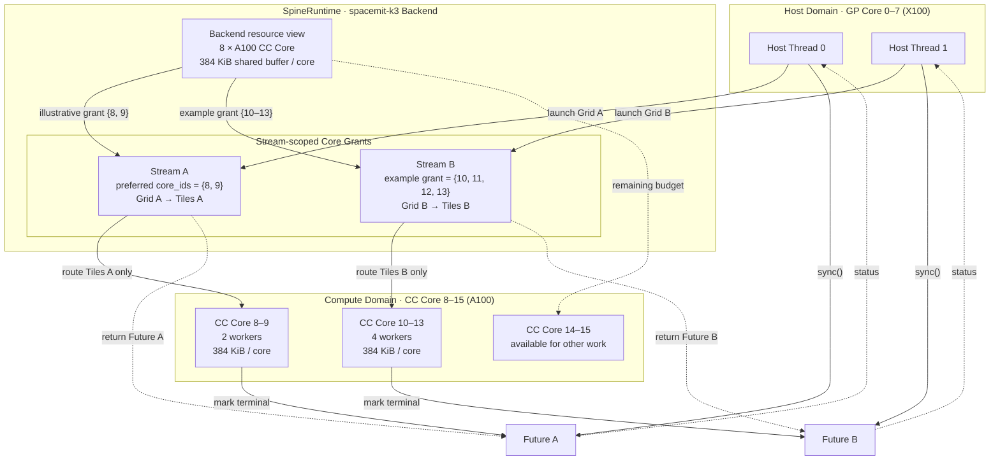
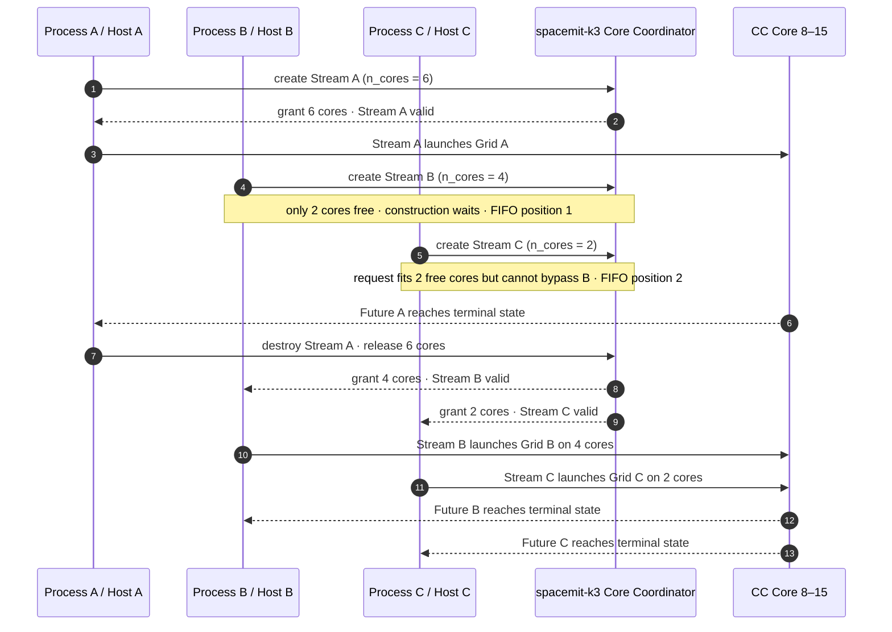

# SpineRuntime

[English](README.md) | 简体中文

**SpacemiT RISC-V AI 众核执行运行时**

SpineRuntime（库名 `spert`）面向 SpacemiT RISC-V SoC，负责在宿主通用核与 AI 计算核之间组织并行任务。SDK 以预编译动态库 `libspert`、C++ 公共头文件和编译器集成 ABI 的形式交付；应用只需描述计算网格与 tile kernel，运行时负责 Backend 选择、计算核资源申请、任务调度、同步和资源回收。

## 简介

SpineRuntime 提供 Tile-SPMD（Single Program, Multiple Data）编程模型：一次 `launch` 将同一个 kernel 实例化为一组 tile，每个 tile 处理网格中的一个坐标。应用无需直接管理 AI 计算核线程，可通过统一接口在不同 SpacemiT 平台和 generic/qemu 环境中运行相同的调度代码。

核心特性包括：

- **现代 C++17 API**：使用强类型参数、RAII 句柄和 `enum class Status`，无需手工封装 `void*` 参数。
- **1D/2D/3D Tile-SPMD**：通过 `Grid` 描述并行空间，通过 `Context` 查询 tile 坐标和网格维度。
- **Stream 级多核执行**：每个 `Stream` 持有一组 Backend 授予的计算核资源，提交到该 Stream 的 tile 只在对应资源范围内执行。
- **异步任务与组合等待**：`launch` 返回 `Future`，支持单任务等待、超时等待和多个任务的合并等待。
- **tile 内协作**：提供全网格同步、Barrier、Event、子任务 `spawn/join` 和协作式 `yield`。
- **每核共享缓冲区**：kernel 可访问当前计算核的共享暂存区，也可按需申请和释放 tile 私有片段。
- **多 Backend 共存**：支持自动选择默认 Backend，也支持通过名称获取独立的 `BackendHandle`。
- **稳定集成边界**：模板参数在应用侧完成类型封装，预编译运行时通过非模板接口接收任务；二进制兼容范围以匹配的 SDK 头文件和 `libspert` SONAME 主版本为边界。

整体使用关系如下：

```text
宿主应用 / 编译器生成代码
           │
           ├── C++ API：spert.hpp
           └── 集成 ABI：spert_abi.h
                       │
                 BackendHandle
                       │
          ┌────────────┴────────────┐
        Stream A                  Stream B
          │                         │
     Grid → Tiles              Grid → Tiles
          │                         │
     获授予的 CC Core          获授予的 CC Core
```

## 快速开始

quickstart demo 是 [`examples/quickstart`](examples/quickstart) 下的独立 CMake 工程，其 README 介绍 K3 原生编译与使用预编译 SDK 交叉编译两种流程。

## 编程模型

### 核心对象

| 对象 | 作用 |
|---|---|
| `BackendHandle` | 标识一个进程生命周期内有效的 Backend 实例，可复制、非拥有。 |
| `BackendInfo` | 描述 Backend 的计算核数量、每核共享缓冲区容量、向量长度和架构 ID。 |
| `Grid` | 描述 1–3 维 tile 网格，所有有效维度的乘积为 tile 总数。 |
| `StreamConfig` | 配置期望的计算核数量或首选物理核 ID。 |
| `Stream` | move-only RAII 执行域，管理 Backend 授予的计算核资源和任务生命周期。 |
| `Context` | 运行时传给每个 tile 的执行上下文，仅在本次 kernel 调用期间有效。 |
| `Future` | 一次 `launch` 或 `spawn` 的共享完成句柄。 |
| `Barrier` / `Event` | 绑定到创建它们的 Stream，用于 tile 间协作同步。 |
| `SharedBufferView` | 指向当前计算核共享暂存区的非拥有视图。 |

### Tile kernel

kernel 是用户定义的可调用对象，第一个参数必须是 `spert::Context*`。其余参数由 `launch` 按值保存；指针可用于访问共享输入和输出，但调用方必须保证指针指向的数据在 `Future` 完成前保持有效。

每个 tile 执行相同的 kernel，通过以下接口确定自己负责的数据范围：

- `program_id(dim)`：返回当前 tile 在指定维度上的坐标；
- `grid_dim(dim)`：返回指定维度的网格大小。

### 最小示例

下面的示例用 `Grid(2, 4)` 把向量加法划分为 8 个 tile，并将二维 tile 坐标展平为线性索引：

```cpp
#include "spert.hpp"

#include <cstdint>
#include <vector>

void vector_add(spert::Context* ctx,
                const float* a,
                const float* b,
                float* output,
                uint32_t size) {
    const uint32_t grid_x = ctx->grid_dim(0);
    const uint32_t grid_y = ctx->grid_dim(1);
    const uint32_t tile_id = ctx->program_id(1) * grid_x + ctx->program_id(0);
    const uint32_t tiles = grid_x * grid_y;

    for (uint32_t i = tile_id; i < size; i += tiles) {
        output[i] = a[i] + b[i];
    }
}

int main() {
    constexpr uint32_t size = 4096;
    std::vector<float> a(size, 1.0f);
    std::vector<float> b(size, 2.0f);
    std::vector<float> output(size, 0.0f);

    spert::Stream stream;
    if (!stream.valid()) {
        return 1;
    }

    spert::Future future = stream.launch(
        spert::Grid(2, 4), vector_add, a.data(), b.data(), output.data(), size);
    if (!future.valid()) {
        return 2;
    }

    const spert::Status status = future.sync();
    return status == spert::Status::Ok ? 0 : 3;
}
```

### 任务依赖与同步

`launch` 是异步提交接口。存在读写依赖的 kernel 应通过 `Future::sync()`、`Future::sync_all()` 或 tile 内协作原语显式建立执行顺序；没有依赖的任务可以先连续提交，再统一等待。

```cpp
auto f0 = stream.launch(spert::Grid(n), kernel0, args0);
auto f1 = stream.launch(spert::Grid(n), kernel1, args1);

spert::Status status = spert::Future::sync_all({f0, f1});
spert::Status timed = spert::Future::sync_all({f0, f1}, 1000);
```

带超时的等待只影响本次等待调用，不会取消正在执行的任务。

## 多核调度模型

### Stream 与计算核资源

`Stream` 是 SpineRuntime 的多核执行与资源隔离单位。创建 Stream 时，运行时向指定 Backend 申请一组计算核；`n_cores == 0` 表示申请当前可用的全部计算核。应用也可以通过 `StreamConfig::core_ids` 指定首选物理核 ID；若精确核集合不可授予，运行时回退到核数量请求。

```cpp
spert::BackendHandle backend = spert::backend("spacemit-k3");
if (!backend.valid()) {
    return 1;
}

spert::StreamConfig config;
config.n_cores = 2;
config.core_ids = {8, 9};

spert::Stream stream(backend, config);
if (!stream.valid()) {
    return 2;
}
```

每个 Backend 实例维护独立的运行时资源。一个进程可以创建多个 Stream，也可以让多个宿主线程并发向同一个 Stream 提交任务。不同 Stream 的实际并行度由 Backend 授予的计算核集合、平台资源状态和系统调度策略共同决定。

### spacemit-k3 调度示例

下图以 K3 上两个相互独立的 Stream 为例，展示 Host 提交、Backend 核授权、tile 路由和 Future 完成之间的关系：



图中的调度过程可以理解为：

1. Host 线程运行在 K3 的 GP Core 0–7 上，可分别或并发地向 Stream 提交 Grid。
2. `spacemit-k3` Backend 向上暴露 8 个 A100 CC Core（物理 ID 8–15），每核提供 384 KiB 共享缓冲区能力。
3. Stream A 以 `{8, 9}` 为首选核集合；图中的 `{8, 9}` 和 Stream B 的 `{10, 11, 12, 13}` 都是资源充足时的示例授权。每个 Stream 的 tile 只路由到自己的获授核集合。
4. 每个 CC Core 对应一个常驻 worker；tile 在 Barrier、Event、Future join 或共享缓冲区等待时可协作式挂起，worker 随后执行其他就绪 tile。
5. 两次 `launch` 分别返回 Future A 和 Future B；CC Core 完成对应 Grid 后将 Future 置为终态，Host 可分别等待，也可使用 `Future::sync_all()` 统一等待。Barrier、Event 和 tile 内的 Future join 只能用于其所属 Stream。

图中的核划分仅用于说明调度关系，并不是固定分区。实际授权取决于当时的可用资源、其他 Stream 或进程的占用以及 Backend 协调结果；应用应检查 `Stream::valid()`，并通过 `Stream::core_count()` 获取实际核数量。

#### 资源竞争时的调度

当多个参与资源协调的进程所创建的 Stream 请求总核数超过 K3 当前可用资源时，Stream 构造会在资源授权阶段等待。下面以三个进程各创建一个 Stream 为例，展示 FIFO 公平性如何避免较晚的小请求绕过较早的大请求：



这个竞争过程体现了以下规则：

- 数量请求采用全有或全无语义。Stream B 请求 4 核时不会先取得当前空闲的 2 核，而是在 Stream 构造阶段等待。
- Stream C 虽然只请求 2 核且当时有 2 核空闲，但它晚于 Stream B 到达，因此不能越过更早的请求。
- Stream A 释放资源后，较早的 Stream B 先获得 4 核，Stream C 随后获得 2 核；授权完成后才能调用 `launch`。
- 若配置了首选 `core_ids`，运行时先尝试非阻塞的精确申请；精确申请失败后回退到数量请求，并可能进入同一 FIFO 等待流程。
- 若 Backend 的有界等待到期仍无法满足请求，Stream 构造失败，应用通过 `Stream::valid() == false` 识别并决定重试、降级或退出。

上述行为适用于启用了资源协调的 SpacemiT 实板 Backend，协调范围覆盖遵守同一协议的进程及其 Stream。`generic/qemu` 不提供等价的跨进程核预算协调；该机制也不是内核强制隔离，不遵守协议的进程仍可能造成平台级竞争。

### Tile 调度与协作

运行时在 Backend 可见的计算核上准备常驻执行线程，并将 Stream 中的 tile 分发到该 Stream 获得的核集合。tile 遇到 `yield`、Barrier、Event、`join` 或共享缓冲区等待时会协作式挂起，使对应计算核可以继续执行其他就绪 tile；条件满足后，tile 自动恢复。

```text
Host Thread(s)
      │ launch
      ▼
    Stream ── Core Grant
      │
      ├── ready tile ───────────────► CC Core worker
      ├── waiting tile ◄── wake ─── Barrier / Event / Future
      └── completed tile ───────────► Future
```

该模型具有以下语义：

- 同一 Stream 内的 Barrier、Event 和 Future join 可用于 tile 间协作；跨 Stream 使用返回 `CrossStream`。
- 同一 Backend 下的多个 Stream 分别持有自己的核授权与同步对象。
- 实板 Backend 可协调多个进程的计算核预算；最终执行仍受平台内核调度策略管理。
- Stream 析构时自动停止接收新任务、结束或取消未完成任务，并归还 Backend 资源。
- 运行时可通过状态码报告参数错误、资源不足、等待超时、协作式死锁和 Backend 不可用等情况。

### 每核共享缓冲区

每个计算核执行线程对应一块共享暂存区。应用可选择：

- 使用 `Context::shared_buffer()` 查看当前执行位置的完整共享缓冲区；
- 使用 `Context::alloc_shared()` 申请一个片段，并通过 `Context::free_shared()` 释放。

共享缓冲区可能来自平台 TCM，也可能由 Backend 提供等价的内存回退区。应用应只依赖 `SharedBufferView` 的 `data` 和 `size` 契约，不依赖具体存储来源。申请得到的片段必须由同一个 tile 释放；未持有申请片段时，不应假设 tile 在协作式挂起前后仍位于同一个计算核。

## API 与功能介绍

### Backend 与运行时查询

| API | 功能 |
|---|---|
| `backend(name)` | 按名称获取或初始化 Backend，失败时返回无效句柄。 |
| `default_backend()` | 获取运行时自动选择的默认 Backend。 |
| `BackendHandle::valid()` | 判断 Backend 句柄是否有效。 |
| `backend_info()` | 查询默认 Backend 的 `BackendInfo`。 |
| `backend_info(handle)` | 查询指定 Backend 的 `BackendInfo`。 |
| `runtime_stats()` | 获取默认 Backend 的资源快照，适用于诊断和测试，不建议用于 kernel 热路径。 |

### Stream 与任务提交

| API | 功能 |
|---|---|
| `Stream()` / `Stream(n_cores)` | 在默认 Backend 上创建 Stream。 |
| `Stream(handle, config)` | 在指定 Backend 上按配置创建 Stream。 |
| `Stream::valid()` | 判断 Stream 是否成功取得运行时资源。 |
| `Stream::core_count()` | 返回实际授予给 Stream 的计算核数量。 |
| `Stream::launch(grid, fn, args...)` | 启动 Tile-SPMD 任务并返回 `Future`。 |
| `Stream::make_barrier(total)` | 创建指定参与者数量的 Stream 级 Barrier。 |
| `Stream::make_event()` | 创建手动复位的 Stream 级 Event。 |

### Future 与同步对象

| API | 功能 |
|---|---|
| `Future::valid()` | 判断完成句柄是否有效。 |
| `Future::sync()` | 等待任务进入最终状态。 |
| `Future::sync(timeout_ms)` | 在指定超时预算内等待。 |
| `Future::sync_all(futures)` | 等待一组任务并返回首个非 `Ok` 状态。 |
| `Future::sync_all(futures, timeout_ms)` | 在全组共享的超时预算内等待。 |
| `Event::signal()` | 置位 Event 并唤醒等待 tile。 |
| `Event::reset()` | 将 Event 恢复为未置位状态。 |
| `Barrier::valid()` / `Event::valid()` | 判断同步对象句柄是否有效。 |

`Future`、`Barrier` 和 `Event` 都是可复制、可移动的共享 RAII 句柄；底层对象在最后一个句柄释放且生命周期条件满足后由运行时回收。

### Context

| API | 功能 |
|---|---|
| `program_id(dim)` / `grid_dim(dim)` | 查询 tile 坐标和网格维度。 |
| `yield()` | 协作式让出当前计算核。 |
| `sync()` | 同步当前 launch 的全部 tile。 |
| `barrier(barrier)` | 等待同一 Stream 创建的 Barrier。 |
| `wait(event)` | 等待同一 Stream 创建的 Event。 |
| `spawn(fn, args...)` | 在当前 Stream 派生一个子任务并返回 `Future`。 |
| `join(future)` | 协作式等待同一 Stream 的 Future。 |
| `prefetch(addr)` | 发出尽力而为的读预取提示。 |
| `shared_buffer()` | 获取当前计算核的完整共享缓冲区视图。 |
| `alloc_shared(bytes, alignment)` | 协作式申请共享缓冲区片段。 |
| `free_shared(view)` | 释放当前 tile 申请的共享缓冲区片段。 |

### 状态码

| `Status` | 含义 |
|---|---|
| `Ok` | 操作成功完成。 |
| `InvalidArg` | 句柄、指针、维度或参数无效。 |
| `Deadlock` | 当前 Stream 进入已确认的协作式死锁状态。 |
| `Timeout` | 调用方给定的等待期限已到。 |
| `BackendUnavailable` | Backend 不可用、初始化失败或正在关闭。 |
| `Unsupported` | 当前上下文或平台不支持该操作。 |
| `NoMem` | 运行时资源分配失败。 |
| `Failed` | 发生未归类为其他状态的一般错误。 |
| `Cancelled` | Stream 关闭过程中任务被取消，或操作了已关闭 Stream 所属的同步对象。 |
| `CrossStream` | 从其他 Stream 使用了 Stream 级对象。 |

可使用 `spert::to_string(status)` 获取状态的稳定英文名称。

### 编译器集成 ABI

`spert_abi.h` 为编译器生成代码和 MLIR Runner 等集成场景提供 `extern "C"` ABI，主要符号包括：

| 接口组 | 功能 |
|---|---|
| `spine_get_*` | 查询默认 Backend 的架构 ID、共享缓冲区容量、向量长度和计算核数量。 |
| `spine_require_stream*` / `spine_release_stream` | 获取和释放 Stream 句柄。 |
| `spine_parallel_dispatch_*` | 同步启动 1D、2D 或 3D 网格。 |
| `spine_parallel_dispatch_*_async` / `spine_parallel_sync` | 异步启动网格并消费完成 token。 |
| `spine_grid` | 查询当前 tile 在指定维度上的坐标。 |
| `spine_thread_tcm_malloc` / `spine_thread_tcm_free` | 申请和释放 tile 的每核共享内存片段。 |
| `spine_alloc_with_id` / `spine_free_with_id` | 可覆盖的带 ID 内存分配钩子。 |

此外，`spert_abi.h` 提供头文件内联辅助函数 `spine_thread_cpu_relax()`，用于发出架构相关的 CPU relax 提示；该函数不是动态库导出的可链接 ABI 符号。

应用开发优先使用 `spert.hpp`；只有编译器、代码生成器或既有 ABI 适配层需要直接使用 `spert_abi.h`。

### 闭源包集成

SDK 运行时要求 C++17。使用 CMake 包配置时，将 SDK 根目录加入 `CMAKE_PREFIX_PATH`：

```cmake
cmake_minimum_required(VERSION 3.30)
project(spine_runtime_app LANGUAGES CXX)

set(CMAKE_CXX_STANDARD 17)
set(CMAKE_CXX_STANDARD_REQUIRED ON)

find_package(spine-runtime CONFIG REQUIRED)

add_executable(spine_runtime_app main.cpp)
target_link_libraries(spine_runtime_app PRIVATE spine-runtime::spert)
```

```bash
cmake -S . -B build -DCMAKE_PREFIX_PATH=/path/to/spine-runtime
cmake --build build
```

也可以通过 `pkg-config` 获取头文件和链接参数：

```bash
export PKG_CONFIG_PATH=/path/to/spine-runtime/lib/pkgconfig${PKG_CONFIG_PATH:+:${PKG_CONFIG_PATH}}
pkg-config --cflags --libs spine-runtime
```

如果 SDK 使用 `lib64` 目录，应相应改为 `lib64/pkgconfig`。运行应用时，还需将 SDK 的 `lib`（或 `lib64`）目录安装到系统动态库搜索路径，或通过目标系统的动态链接器配置使 `libspert` 可见。

## 支持的 Backend 模式

SpineRuntime 支持自动选择和显式选择两种方式：

```cpp
// 自动探测真实平台；未探测到实板时使用 generic/qemu。
spert::BackendHandle automatic = spert::default_backend();

// 按名称显式获取 Backend。
spert::BackendHandle k1 = spert::backend("spacemit-k1");
spert::BackendHandle k3 = spert::backend("spacemit-k3");
spert::BackendHandle generic = spert::backend("generic/qemu");
```

| Backend 名称 | 目标平台 / 用途 | 默认计算核拓扑 | 每核共享缓冲区 | 选择方式 |
|---|---|---|---:|---|
| `spacemit-k1` | SpacemiT K1 AI 计算核 | CC Core `{0, 1, 2, 3}` | 128 KiB | K1 实板自动选择，或按名称显式选择。 |
| `spacemit-k3` | SpacemiT K3 A100 AI 计算核 | CC Core `{8, 9, 10, 11, 12, 13, 14, 15}` | 384 KiB | K3 实板自动选择，或使用 `spacemit-k3` / `spacemit` 显式选择。 |
| `spacemit-k3-x100` | K3 X100 核集的兼容执行模式 | Core `{4, 5, 6, 7}` | 384 KiB 等价回退区 | 按名称显式选择，或作为 generic 模拟目标。 |
| `generic/qemu` | 普通 Linux、qemu-user 和无实板环境下的功能开发与验证 | 逻辑 Core `0..N-1`，由模拟目标决定 | 跟随模拟目标 | 未探测到实板时自动选择，或使用 `generic` / `generic/qemu` 显式选择。 |

在未探测到真实 SpacemiT 平台时，generic/qemu 默认模拟 `spacemit-k3` 的核数量与硬件信息。可在进程启动前通过 `SPERT_BACKEND` 选择 `spacemit-k1`、`spacemit-k3` 或 `spacemit-k3-x100` 作为模拟目标。真实平台探测结果优先于该环境变量。

generic/qemu 用于验证编程模型、调度流程和 API 集成，不代表真实 AI 计算核的性能、绑核效果或 TCM 行为。应用可通过 `backend_info()` 在运行时查询最终可见的核数量、共享缓冲区容量、向量长度和架构 ID，避免把平台参数写死在业务代码中。
