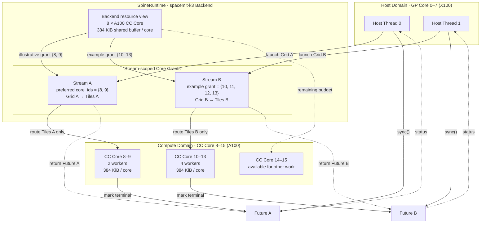

# Multicore Scheduling Model

## Streams and Compute-Core Resources

`Stream` is SpineRuntime's unit of multicore execution and resource isolation. When a Stream is created, the runtime requests a set of compute cores from the specified Backend. `n_cores == 0` requests all compute cores that are currently available. An application can also use `StreamConfig::core_ids` to specify preferred physical core IDs. If the exact core set cannot be granted, the runtime falls back to a core-count request.

```cpp
spert::BackendHandle backend = spert::backend("spacemit-k3");
if (!backend.valid()) {
    return 1;
}

spert::StreamConfig config;
config.n_cores = 2;
config.core_ids = {8, 9};

spert::Stream stream(backend, config);
if (!stream.valid()) {
    return 2;
}
```

Each Backend instance maintains independent runtime resources. A process can create multiple Streams, and multiple host threads can concurrently submit tasks to the same Stream. The effective parallelism of different Streams is jointly determined by the compute-core sets granted by the Backend, platform resource availability, and system scheduling policy.

## spacemit-k3 Scheduling Example

The following diagram uses two independent Streams on K3 to illustrate the relationship between Host submission, Backend core grants, tile routing, and Future completion:



The scheduling process shown in the diagram can be understood as follows:

1. Host threads run on K3 GP Cores 0–7 and can submit Grids to Streams separately or concurrently.
2. The `spacemit-k3` Backend exposes eight A100 CC Cores (physical IDs 8–15), each with 384 KiB of shared-buffer capacity.
3. Stream A prefers the core set `{8, 9}`. Both `{8, 9}` and Stream B's `{10, 11, 12, 13}` are example grants when sufficient resources are available. Each Stream's tiles are routed only to its own granted core set.
4. Each CC Core has one resident worker. When a tile waits on a Barrier, Event, Future join, or shared-buffer allocation, it can be cooperatively suspended so that the worker can execute another ready tile.
5. The two `launch` calls return Future A and Future B respectively. After the CC Cores complete the corresponding Grid, they move its Future to a terminal state. The Host can wait for each Future separately or use `Future::sync_all()` to wait for both. Barriers, Events, and in-tile Future joins can be used only within their owning Stream.

The core allocation in the diagram illustrates scheduling relationships only; it is not a fixed partition. Actual grants depend on currently available resources, usage by other Streams or processes, and Backend coordination. Applications should check `Stream::valid()` and obtain the actual core count through `Stream::core_count()`.

### Scheduling Under Resource Contention

When Streams created by multiple resource-coordinating processes collectively request more cores than K3 currently has available, Stream construction waits during the resource-grant phase. The following example, in which three processes each create one Stream, shows how FIFO fairness prevents a later small request from bypassing an earlier large request:

```mermaid

